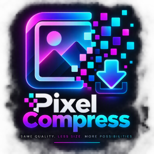

  

# PixelCompress

Compress images right in your browser. PixelCompress is a single HTML file with no server, no build step and no dependencies. Your images never leave your computer.

> The interface is in German.

## About

PixelCompress is a small helper I made for shrinking images at work. It was built with AI assistance using [Claude Code](https://claude.com/claude-code).

## Usage

1. Download [`pixelcompress.html`](pixelcompress.html) and open it in a browser. You can also serve it with GitHub Pages or any static host.
2. Add images in any of these ways:
   - drag them onto the drop area,
   - click the drop area to pick files,
   - paste with <kbd>Ctrl</kbd>+<kbd>V</kbd>.

   You can add several images at once.
3. Adjust the settings. Every loaded image is re-compressed right away.
4. Download images one at a time, or use **Alle herunterladen** to download all of them. Files are saved as `<name>-komprimiert.<ext>`.

## Features

| Setting | What it does |
|---|---|
| **Ausgabeformat** (output format) | JPEG, WebP, PNG or AVIF. AVIF is only listed when your browser can encode it. **Wie Original** keeps the input format; GIF and BMP are saved as WebP instead. |
| **Qualität festlegen** (set quality) | Sets the encoder quality with a slider (5–100 %). |
| **Zielgröße erreichen** (reach target size) | Enter a maximum file size in KB. PixelCompress searches for the highest quality that stays under that size. If even the lowest quality is too large, it also scales the image down. |
| **Max. Abmessungen** (max. dimensions) | Optional maximum width and height. The aspect ratio is kept. |

For each image you get:
- a slider to compare the original and the compressed version,
- the size and dimensions before and after,
- the savings in percent,
- a warning if the result is not smaller than the original.

Your settings are saved in the browser's local storage.

## How it works

Images are decoded with `createImageBitmap`, which also applies EXIF rotation. They are drawn onto a `<canvas>` and encoded with `canvas.toBlob()` in the chosen format and quality. The **Zielgröße erreichen** mode runs a binary search over the quality value. If no quality is small enough, it reduces the dimensions step by step.

Things to know:
- **Metadata** (EXIF, GPS, color profiles) is removed.
- **Transparency** is filled with white when exporting to JPEG.
- **PNG** is lossless, so it can only get smaller by scaling the image down.
- **Animated GIFs** keep only their first frame.

## Browser support

PixelCompress works in current versions of Chrome, Edge, Firefox and Safari. Which output formats you can pick depends on the browser: Chrome and Edge can encode JPEG, WebP and PNG, and AVIF only appears where the browser can encode it.
